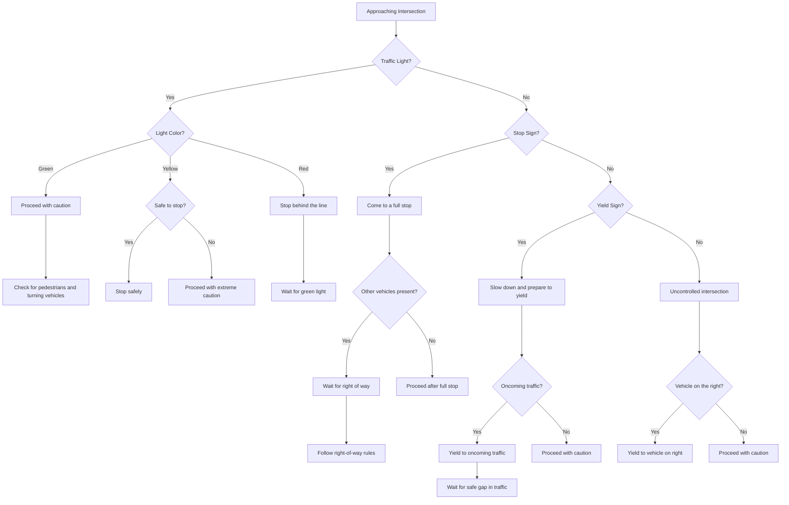

<Snippet file="andrei.mdx" />
Road signs are vital for safe driving, providing information about the road ahead, guiding traffic flow, and ensuring the safety of all road users. This guide introduces the basics of road signs. For a more comprehensive understanding of road signs, including detailed definitions, shapes, and colors, be sure to visit our [Road Sign Encyclopedia](https://driving-tests.org/road-signs/).

## Approaching an Intersection
This diagram illustrates the decision-making process for approaching an intersection. It will help you understand the steps and considerations you need to make when encountering different types of intersections.

## Regulatory Signs

These signs instruct drivers on what they must or must not do.

### Stop Sign

- **Shape**: Octagon
- **Color**: Red
- **Action**: Come to a full stop and proceed when safe.

### Yield Sign

- **Shape**: Downward triangle
- **Color**: Red and white
- **Action**: Slow down and give way to traffic and pedestrians.

### Speed Limit Sign

- **Shape**: Rectangle
- **Color**: White with black lettering
- **Action**: Do not exceed the posted speed.

## Warning Signs

Warning signs alert drivers to potential hazards or changes in road conditions.

### Curve Ahead

- **Shape**: Diamond
- **Color**: Yellow with black symbols
- **Action**: Slow down for an upcoming curve.

### Pedestrian Crossing

- **Shape**: Diamond or rectangle
- **Color**: Yellow with black symbols
- **Action**: Watch for and yield to pedestrians.

### School Zone

- **Shape**: Pentagonal
- **Color**: Yellow with black symbols
- **Action**: Slow down and observe posted speed limits.

## Guide Signs

Guide signs provide directional and mileage information to specific destinations.

### Interstate Sign

- **Shape**: Shield
- **Color**: Red, white, and blue
- **Action**: Follow for routes on the interstate highway.

### Street Name Sign

- **Shape**: Rectangle
- **Color**: Green with white lettering
- **Action**: Identifies the street or road.

## Informational Signs

These signs provide helpful information and points of interest.

### Hospital Nearby

- **Shape**: Rectangle or square
- **Color**: Blue with white symbols
- **Action**: Indicates access to medical facilities.

### No Parking

- **Shape**: Rectangle
- **Color**: Red and white
- **Action**: Parking is not allowed in the designated area.

Remember, recognizing and obeying road signs is a key component of responsible driving. Familiarize yourself with these signs to ensure your safety and the safety of others on the road.
